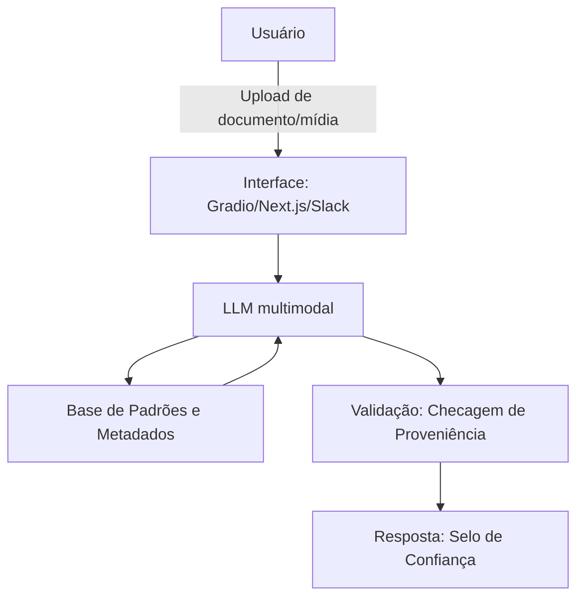

# 🔎 ACE — Agente de Verificação de Proveniência Financeira

Agente de IA Generativa que analisa a **autenticidade de documentos e mídias** usados em operações financeiras (comprovantes, laudos, contratos, procurações, gravações de venda), sinalizando o grau de confiança de origem antes que o arquivo vire base para uma decisão de crédito, sinistro ou compliance.

## Problema

Documentos e mídias financeiras podem hoje ser gerados ou adulterados por IA a baixo custo. A ACE atua na **entrada do fluxo** — não como investigação posterior ao dano —, extraindo metadados técnicos (hash, EXIF, padrão de compressão) e comparando-os com padrões conhecidos de fraude e com referências legítimas.

**Público-alvo:** analistas de crédito, compliance/PLD, subscritores de seguro, auditoria interna e gerentes de relacionamento.

## Como a ACE se comporta

- Nunca declara um documento "falso" ou "verdadeiro" — responde sempre com **grau de confiança** (baixa/média/alta) e a evidência técnica que sustenta esse número.
- Nunca toma ou sugere a decisão final da operação — apenas informa; a decisão continua humana.
- Quando a confiança está abaixo do limiar definido, escala automaticamente para verificação humana.
- Não opina sobre arquivos fora do escopo financeiro autorizado.

## Arquitetura



A validação usa **NeMo Guardrails** para impor linguagem probabilística, exigir citação de evidência técnica, bloquear decisões automáticas e escalar casos de baixa confiança para um analista humano.

## Estrutura do repositório

```
├── docs/
│   ├── 01-documentacao-agente.md   # Caso de uso, persona, arquitetura e segurança
│   ├── 02-base-conhecimento.md     # Estratégia de dados e metadados
│   ├── 03-prompts.md               # System prompt, exemplos e edge cases
│   ├── 04-metricas.md              # Avaliação e métricas de qualidade
│   └── 05-pitch.md                 # Roteiro do pitch
├── data/                           # Dados mockados (transações, perfil, produtos)
├── src/                            # Aplicação (protótipo em desenvolvimento)
└── assets/                         # Roteiro e materiais de apoio
```

## Status

Documentação completa em `docs/`. O código do protótipo (`src/`) ainda está em desenvolvimento.

## Créditos

Desafio original: [digitalinnovationone/dio-lab-bia-do-futuro](https://github.com/digitalinnovationone/dio-lab-bia-do-futuro) (DIO).
