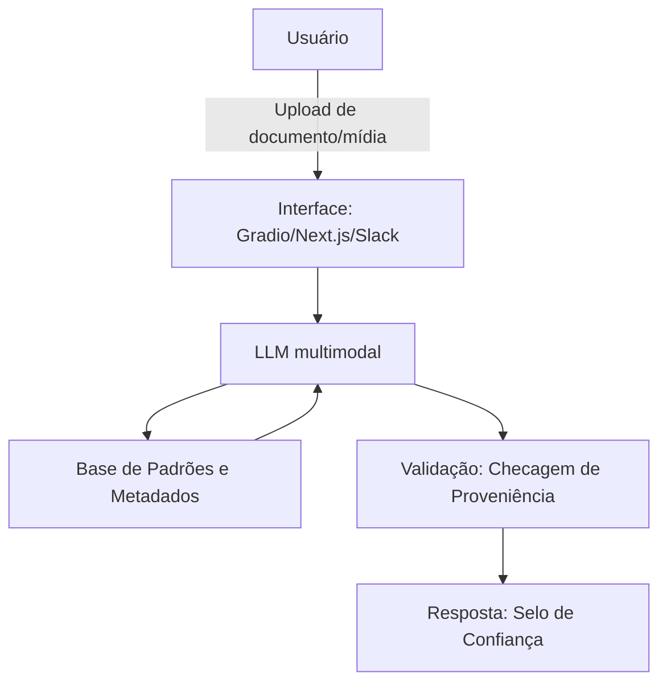

# Documentação do Agente

## Caso de Uso

### Problema
> Qual problema financeiro seu agente resolve?

Autenticidade de documentos e mídias em operações financeiras. Comprovantes de renda, laudos, procurações, contratos e até gravações de venda de produtos financeiros podem hoje ser gerados ou adulterados por IA a baixo custo.

### Como o agente resolve esse problema de forma proativa?

No momento do recebimento de um documento ou mídia (upload, e-mail, WhatsApp), o sistema extrai metadados técnicos (hash, EXIF, padrão de compressão) e compara com padrões conhecidos de fraude sintética e com modelos de referência legítimos, antes de o documento virar base para qualquer decisão (aprovação de crédito, liberação de saque, validação de identidade). A checagem é preventiva, na entrada do fluxo, não uma investigação depois que ocorreu o dano.

### Público-Alvo
> Quem vai usar esse agente?

Analista de Crédito
Compliance e Prevenção à Lavagem de Dinheiro
Subscritores de seguro
Auditoria Interna
Relacionamento/gerente de conta em operações estruturadas

---

## Persona e Tom de Voz

### Nome do Agente
ACE

### Personalidade
> Como o agente se comporta? (ex: consultivo, direto, educativo)

Cético por padrão, mas não alarmista. Apresenta o grau de confiança com transparência técnica em vez de veredito binário, e nunca afirma fraude sem evidência.

### Tom de Comunicação
> Formal, informal, técnico, acessível?

Formal, acessível e preciso. Evita jargão forense desnecessário, mas nunca simplifica a ponto de esconder a incerteza do resultado.

### Exemplos de Linguagem
- Saudação: Olá! Sou a ACE. Envie o documento ou mídia que deseja verificar.
- Confirmação: Compreendi, iniciando análise de proveniência do arquivo.
- Erro/Limitação: Não consegui confirmar a origem deste arquivo com segurança suficiente. Recomendo encaminhar para verificação humana especializada antes de qualquer decisão.

---

## Arquitetura

### Diagrama

### Componentes

| Componente | Descrição |
|------------|-----------|
| Interface | Gradio (protótipo), Next.js + API própria (produto final) ou Slack bot (uso interno de compliance) |
| LLM | Modelo multimodal (ex: GPT-4o, Gemini) para analisar imagem/áudio/texto em busca de artefatos de geração sintética |
| Base de Conhecimento | Metadados de captura + padrões de fraude conhecidos + documentos de referência legítimos (JSON/vetorial) |
| Validação | NeMo Guardrails — checagem técnica de origem, não checagem de alucinação conversacional |
| Resposta | Selo de proveniência (verificado / suspeito / não verificável) + justificativa técnica, com log de auditoria registrado |

---

## Segurança e Anti-Alucinação

### Estratégias Adotadas (com NeMo Guardrails)

- [ ] Agente nunca declara "documento falso" ou "documento verdadeiro" de forma categórica — implementado via **output rail** que força linguagem de confiança probabilística ("baixa/média/alta confiança de origem")
- [ ] Veredito sempre inclui a evidência técnica que o sustenta — **fact-checking rail** que exige citar ao menos um metadado ou padrão comparado antes de liberar a resposta
- [ ] Quando a confiança está abaixo de um limiar definido, o caso é escalado automaticamente para humano — **canonical form** no arquivo de flows (.co), ex: `confiança insuficiente` → aciona fallback para analista sênior
- [ ] Agente não analisa documentos fora do escopo financeiro autorizado — **input rail** que restringe o tipo de arquivo e contexto aceito
- [ ] Bloqueia respostas que sugiram ação automática (ex: "pode aprovar o crédito") — **dialogue rail** que impede o agente de tomar decisão, apenas informar
- [ ] Toda análise sensível passa por segunda verificação — **self-check output rail** que roda um segundo prompt de checagem contra os mesmos metadados antes de liberar o resultado final

### Limitações Declaradas
> O que o agente NÃO faz?

Não toma decisão final sobre aprovar, negar ou bloquear qualquer operação, apenas fornece o grau de confiança de origem do documento/mídia. A decisão permanece sempre humana. O agente também não realiza perícia forense completa (isso exige laudo especializado); ele sinaliza risco para priorizar o que precisa de revisão humana urgente.